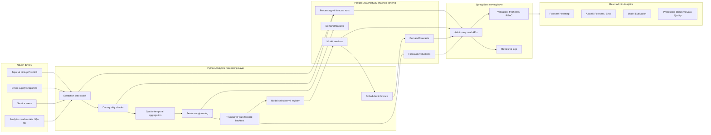
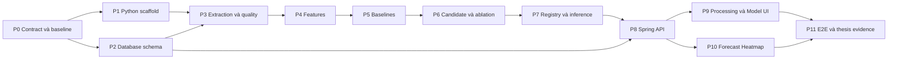

# Kế hoạch triển khai lớp xử lý dữ liệu cho Admin Analytics

> Tên tiếng Việt: **Lớp xử lý dữ liệu phân tích không–thời gian và dự báo nhu cầu cho phân hệ quản trị**
>
> English name: **Spatio-Temporal Data Processing and Demand Forecasting Layer for Admin Analytics**
>
> Ngày lập kế hoạch: 2026-08-08
>
> Trạng thái: Đề xuất triển khai sau khi Phase 8 của Admin Analytics hiện tại được nghiệm thu và baseline được làm sạch
>
> Phạm vi repository: backend `goride`, data processing và frontend Admin `goride-web`

---

## 1. Kết luận phạm vi

Hướng phát triển này **có thể và nên được xây dựng thành một lớp xử lý dữ liệu riêng**, nhưng toàn bộ luận văn chỉ theo một trục nghiên cứu chính:

> Dự báo số yêu cầu chuyến đi theo ô không gian và khoảng thời gian trong tương lai, sau đó trình bày kết quả, độ bất định và chất lượng mô hình trên giao diện Admin.

Các chức năng kiểm tra chất lượng dữ liệu, tổng hợp không–thời gian, feature engineering, model registry, backtesting, API và dashboard không phải các đề tài độc lập. Chúng là các thành phần của cùng một artifact nghiên cứu.

Tên đề tài gợi ý:

- Tiếng Việt: **Thiết kế và đánh giá lớp xử lý dữ liệu phân tích không–thời gian phục vụ dự báo nhu cầu cho hệ thống gọi xe**.
- Tiếng Anh: **Design and Evaluation of a Spatio-Temporal Analytics Processing Layer for Ride-Hailing Demand Forecasting**.

Kế hoạch này mở rộng hệ thống Admin Analytics đã có; không thay thế telemetry, direct queries, materialized views hoặc heatmap lịch sử hiện tại.

---

## 2. Hiện trạng làm nền

Backend hiện đã có:

- matching telemetry bền vững trong PostgreSQL;
- driver-supply snapshots;
- KPI nhu cầu, nguồn cung, matching và doanh thu;
- PostGIS heatmap theo ô vuông;
- direct-query và materialized-query variants;
- freshness metadata, fallback và observability;
- bộ sinh dữ liệu và benchmark tái lập cho workload phân tích;
- Admin-only REST API dưới `/api/v1/admin/analytics`.

Giới hạn hiện tại:

- chỉ mô tả dữ liệu quá khứ, chưa dự báo tương lai;
- dataset smoke chỉ chứng minh quy trình benchmark, chưa phải kết quả luận văn ở quy mô đủ lớn;
- chưa có pipeline chuẩn hóa dữ liệu cho machine learning;
- chưa có feature store, model registry, forecast run hoặc evaluation store;
- chưa có API và UI cho actual/forecast/error, độ bất định và so sánh mô hình;
- frontend Analytics hiện tại là nền để mở rộng, không được giả định đã tích hợp vào nhánh phát hành nếu chưa xác nhận baseline.

### 2.1 Điều kiện tiên quyết bắt buộc

Trước Phase 1 phải hoàn thành Phase 0 trong kế hoạch này:

- khôi phục cấu hình datasource dùng biến môi trường và xoay credential từng xuất hiện trong Git history;
- giữ nguyên các file cấu hình cục bộ của người phát triển, không commit secret;
- ghi nhận rõ các lỗi regression không thuộc Analytics thay vì sửa lẫn trong feature này;
- xác nhận nhánh frontend chứa Admin Analytics hiện tại sẽ được dùng làm baseline;
- chạy được bộ test Analytics không phụ thuộc Docker và database release validator;
- có môi trường PostgreSQL/PostGIS để chạy integration test khi bắt đầu thay đổi schema.

---

## 3. Mục tiêu và câu hỏi nghiên cứu

### 3.1 Mục tiêu tổng quát

Thiết kế, triển khai và đánh giá một lớp xử lý dữ liệu có khả năng chuyển dữ liệu vận hành của hệ thống gọi xe thành đặc trưng không–thời gian, tạo dự báo nhu cầu đa bước và cung cấp kết quả có thể kiểm chứng cho Admin qua API và giao diện trực quan.

### 3.2 Mục tiêu cụ thể

1. Xây dựng pipeline có version để kiểm tra, tổng hợp và tạo feature từ dữ liệu chuyến đi.
2. Dự báo số yêu cầu chuyến theo ô không gian cho các horizon 15, 30 và 60 phút.
3. So sánh mô hình được chọn với các baseline đơn giản bằng backtesting theo thời gian.
4. Đánh giá ảnh hưởng của độ phân giải không gian và nhóm feature bằng thí nghiệm có kiểm soát.
5. Lưu model version, forecast run, prediction và evaluation đủ để tái lập.
6. Cung cấp Spring Admin API chỉ đọc và UI thể hiện actual, forecast, error, uncertainty và data freshness.
7. Đánh giá cả chất lượng dự báo lẫn chi phí vận hành của artifact.

### 3.3 Câu hỏi nghiên cứu

| ID | Câu hỏi |
| --- | --- |
| RQ1 | Mô hình đề xuất cải thiện MAE, RMSE và WAPE như thế nào so với historical mean và seasonal-naive ở từng horizon 15/30/60 phút? |
| RQ2 | Độ phân giải ô không gian và độ dài time bucket ảnh hưởng như thế nào đến độ chính xác, độ phủ dữ liệu và chi phí xử lý? |
| RQ3 | Các feature thời gian, độ trễ nhu cầu, lân cận không gian và nguồn cung đóng góp như thế nào vào kết quả dự báo? |
| RQ4 | Lớp xử lý đạt mức nào về thời gian chạy, độ trễ sinh forecast, tính tái lập và khả năng phục vụ API/UI? |

### 3.4 Giả thuyết kiểm chứng

- H1: mô hình có feature thời gian và demand lag giảm lỗi so với seasonal-naive trên tập kiểm thử theo thời gian.
- H2: bổ sung feature lân cận không gian hoặc nguồn cung tạo cải thiện đo được ở các ô có đủ quan sát.
- H3: tăng độ chi tiết không gian không luôn làm dự báo tốt hơn vì số quan sát trên mỗi ô giảm.

Không ghi giả thuyết dưới dạng kết luận. Mọi khẳng định cuối cùng phải dựa trên artifact thí nghiệm.

---

## 4. Ranh giới phạm vi

### 4.1 Phạm vi cốt lõi

- batch processing và scheduled inference;
- target là số `trip request` theo `requested_at`;
- grid vuông PostGIS tương thích heatmap hiện tại;
- bucket mặc định 15 phút;
- horizon 15, 30 và 60 phút;
- historical mean, seasonal-naive và một mô hình học máy tabular;
- rolling-origin backtesting;
- data-quality report, feature set, model registry, forecast/evaluation store;
- Spring Admin API, RBAC, OpenAPI và observability;
- Forecast Heatmap, Model Evaluation và Processing Status trên Admin UI.

### 4.2 Ngoài phạm vi cốt lõi

- dynamic pricing tự động;
- điều phối hoặc tái cân bằng tài xế;
- thay đổi thuật toán matching;
- reinforcement learning;
- streaming/Kafka và dự báo từng giây;
- phát hiện bất thường như một đề tài nghiên cứu thứ hai;
- gọi model trực tiếp từ browser;
- tự động đưa dự báo vào quyết định vận hành có tác động đến người dùng;
- tuyên bố tổng quát cho thành phố khác khi chưa có dữ liệu kiểm chứng.

STGCN, TFT hoặc mô hình deep learning chỉ là **mở rộng có điều kiện**, không phải acceptance criterion. Chỉ thực hiện nếu dữ liệu, thời gian và kết quả baseline đáp ứng cổng quyết định ở Phase 6.

---

## 5. Kiến trúc mục tiêu



### 5.1 Nguyên tắc phân tách trách nhiệm

| Thành phần | Trách nhiệm |
| --- | --- |
| Python processing layer | Data validation, aggregation, feature engineering, training, backtesting và inference |
| PostgreSQL/PostGIS | Nguồn dữ liệu bền vững, spatial grid, run/model/forecast/evaluation store |
| Spring Boot | RBAC, validation, read API, pagination, freshness, error contract và observability |
| React Admin | Filter, map/chart/table, trạng thái loading/empty/error và giải thích kết quả |

Frontend không gọi Python. Spring Boot không huấn luyện mô hình trong request HTTP. Pipeline không cập nhật ngược bảng nghiệp vụ của booking, payment hoặc matching.

### 5.2 Hình thức chạy

- Local/thesis experiment: CLI reproducible.
- Môi trường tích hợp: scheduled batch hoặc job runner gọi cùng CLI.
- Training và inference là hai command riêng.
- Model chỉ được production inference khi có trạng thái `APPROVED`.
- Mỗi run dùng một immutable cutoff để tránh đọc dữ liệu tương lai trong lúc chạy.

---

## 6. Cấu trúc mã nguồn đề xuất

### 6.1 Backend repository `goride`

```text
analytics-processing/
  pyproject.toml
  README.md
  configs/
    smoke.yml
    thesis.yml
  src/goride_analytics/
    cli.py
    config.py
    extraction/
    quality/
    aggregation/
    features/
    models/
    evaluation/
    registry/
    persistence/
  tests/
    unit/
    integration/
    fixtures/

src/main/java/com/example/goride/analytics/
  controller/
  dto/
  model/
  repository/
  service/
  config/

db/releases/<date>-admin-demand-forecasting/
  manifest.yml
  precheck.sql
  apply.sql
  verify.sql
  rollback.sql

docs/admin-demand-forecasting/
  data-contract.md
  feature-dictionary.md
  model-card.md
  evaluation-protocol.md
  api-contract.md
  runbook.md
```

### 6.2 Frontend repository `goride-web`

Tên file cuối cùng cần tuân theo conventions của code frontend tại thời điểm triển khai. Cấu trúc dự kiến:

```text
src/
  pages/analytics/
    AnalyticsForecastPage.jsx
    AnalyticsModelEvaluationPage.jsx
    AnalyticsProcessingPage.jsx
  components/analytics/
    ForecastMap.jsx
    ForecastLegend.jsx
    ForecastTimeline.jsx
    ActualForecastErrorChart.jsx
    ForecastHotspotTable.jsx
    ModelComparisonTable.jsx
    DataQualityPanel.jsx
    ProcessingRunTable.jsx
  services/
    analyticsForecastService.js
  mappers/
    analyticsForecastMapper.js
```

---

## 7. Hợp đồng dữ liệu

### 7.1 Quy ước bắt buộc

- Timestamps lưu UTC; reporting timezone mặc định `Asia/Ho_Chi_Minh`.
- Mọi khoảng thời gian dùng `[from, to)`.
- `training_cutoff` và `inference_cutoff` là immutable.
- Target tại bucket `t` chỉ dùng dữ liệu có event time thuộc bucket `t`.
- Feature cho dự báo `t+h` chỉ được dùng dữ liệu khả dụng tại cutoff `t`.
- Grid origin, projected SRID và `cell_size_meters` phải được version hóa.
- Ô không đủ dữ liệu phải có cờ coverage; không biến missing thành zero ngoài quy tắc đã định nghĩa.
- Mọi số liệu UI lấy từ API chuẩn hóa, không tự tính lại metric quan trọng ở browser.

### 7.2 Bảng tối thiểu

| Bảng | Vai trò | Khóa/idempotency chính |
| --- | --- | --- |
| `analytics.processing_runs` | Theo dõi extraction, quality, feature, training và inference job | `run_id`; unique theo `run_type + config_hash + cutoff` khi phù hợp |
| `analytics.data_quality_results` | Kết quả từng rule trong một processing run | unique `run_id + rule_code + scope_key` |
| `analytics.demand_features` | Feature theo grid cell và bucket | unique `feature_set_version + cell_id + bucket_start` |
| `analytics.model_versions` | Metadata và lifecycle của model | unique `model_name + model_version`; artifact checksum bắt buộc |
| `analytics.forecast_runs` | Một lần sinh forecast từ một model | unique `model_version_id + inference_cutoff + config_hash` |
| `analytics.demand_forecasts` | Giá trị dự báo theo cell, target bucket và horizon | unique `forecast_run_id + cell_id + target_bucket_start + horizon_minutes` |
| `analytics.forecast_evaluations` | Metric tổng hợp theo fold/horizon/cell size/slice | unique theo run, metric và evaluation dimensions |

### 7.3 Thuộc tính dữ liệu quan trọng

`processing_runs`:

```text
run_id, run_type, status, started_at, finished_at,
source_cutoff, config_hash, code_commit, input_manifest,
rows_read, rows_written, error_code, error_message
```

`demand_features`:

```text
feature_set_version, cell_id, bucket_start, cell_size_meters,
target_trip_requests, lag_1, lag_2, lag_4, lag_96,
rolling_mean_4, rolling_mean_12, rolling_mean_96,
hour_sin, hour_cos, day_of_week, is_weekend,
neighbor_demand_lag_1, available_driver_lag_1,
coverage_ratio, created_by_run_id
```

Danh sách feature chính thức được chốt ở Phase 4; không đưa feature chưa khả dụng tại prediction cutoff.

`demand_forecasts`:

```text
forecast_run_id, model_version_id, cell_id, cell_geometry,
generated_at, inference_cutoff, target_bucket_start,
horizon_minutes, predicted_demand,
prediction_lower, prediction_upper,
actual_demand, absolute_error, evaluated_at
```

`actual_demand` và `absolute_error` chỉ được backfill sau khi target bucket kết thúc và dữ liệu đạt watermark đã quy định.

---

## 8. Data-quality gates

Pipeline phải kiểm tra ít nhất:

| Nhóm | Rule |
| --- | --- |
| Schema | Cột bắt buộc, kiểu dữ liệu, enum và timezone hợp lệ |
| Completeness | `requested_at` và pickup geometry không null trong tập dùng cho spatial forecasting |
| Validity | Tọa độ hợp lệ, geometry trong vùng hỗ trợ, timestamp không ở tương lai so với cutoff |
| Consistency | `requested_at <= completed_at/cancelled_at` khi các timestamp tồn tại |
| Uniqueness | Không trùng trip ID trong extraction snapshot |
| Coverage | Đủ số bucket lịch sử tối thiểu cho cell được đưa vào training |
| Drift | Thay đổi tỷ lệ missing, số request và phân phối cell so với baseline |
| Leakage | Feature timestamp không vượt inference/training cutoff |

Phân loại kết quả:

- `PASS`: chạy tiếp;
- `WARN`: chạy tiếp nhưng ghi cảnh báo và hiển thị trên Admin;
- `FAIL`: dừng stage, không promote model hoặc publish forecast.

Ngưỡng phải đặt trong config có version, không hard-code rải rác trong source.

---

## 9. Feature engineering và mô hình

### 9.1 Feature groups

1. Thời gian: giờ trong ngày, thứ, cuối tuần, cyclical encoding.
2. Demand lag: 1, 2, 4, 96 bucket và các rolling statistics chỉ nhìn về quá khứ.
3. Không gian: demand lag của các ô kề cạnh; adjacency được tạo từ cùng grid version.
4. Nguồn cung: số tài xế available/online ở bucket trước, kèm coverage.
5. Phạm vi dịch vụ: service area hoặc vehicle type nếu dữ liệu có độ phủ đủ.

Weather, sự kiện hoặc holiday bên ngoài chỉ thêm khi có nguồn dữ liệu hợp lệ, có version và có thí nghiệm ablation. Không để dependency bên ngoài làm chậm phạm vi cốt lõi.

### 9.2 Các mô hình bắt buộc

| Nhóm | Mô hình | Mục đích |
| --- | --- | --- |
| Baseline 1 | Historical mean theo cell/time slot | Mốc đơn giản, dễ giải thích |
| Baseline 2 | Seasonal naive | Dự báo từ cùng time slot của chu kỳ trước |
| Candidate | Gradient-boosted decision trees | Khai thác feature phi tuyến với dữ liệu tabular, chi phí vừa phải |

Tên thư viện cụ thể được chốt ở Phase 1 sau spike tương thích môi trường. Kế hoạch không khóa vào một vendor model trước khi kiểm thử.

### 9.3 Mở rộng có điều kiện

Chỉ thử STGCN hoặc mô hình neural spatio-temporal khi đồng thời đạt:

- dataset thật/công khai có đủ chiều dài và độ phủ cell;
- pipeline baseline đã tái lập và không có leakage;
- candidate tabular đã được đánh giá xong;
- còn đủ thời gian thực hiện tuning và ablation công bằng;
- mô hình mới trả lời trực tiếp một RQ, không chỉ làm đẹp danh sách công nghệ.

Nếu không đạt cổng này, luận văn vẫn hoàn chỉnh với baseline, boosted trees, ablation và đánh giá hệ thống.

---

## 10. Phương pháp đánh giá

### 10.1 Dataset strategy

- `smoke`: dữ liệu synthetic hiện có, dùng kiểm tra pipeline và contract; không dùng để kết luận tính thực tiễn.
- `integration`: fixture nhỏ deterministic cho automated tests.
- `thesis`: ưu tiên dữ liệu GoRide thu thập hợp lệ nếu đủ; nếu không, dùng dataset chuyến đi công khai đã được mô tả rõ nguồn và giới hạn địa lý.
- Không trộn dữ liệu synthetic và thực tế rồi báo như một population duy nhất.

Nếu dùng dữ liệu công khai, cần có adapter riêng để chuyển về canonical trip schema; không sửa metric semantics chỉ để khớp dataset.

### 10.2 Chia tập dữ liệu

- Chia train/validation/test theo thời gian, tuyệt đối không random shuffle toàn bộ records.
- Dùng rolling-origin/walk-forward evaluation.
- Các fold có train window, validation window, test window và cutoff được lưu trong manifest.
- Hyperparameter chỉ chọn trên validation; test chỉ dùng cho báo cáo cuối.

### 10.3 Metrics

| Nhóm | Metric |
| --- | --- |
| Chất lượng dự báo | MAE, RMSE, WAPE theo horizon |
| Phân tích lát cắt | Theo cell size, demand quantile, time-of-day và service area khi đủ mẫu |
| Độ bất định | Coverage và average interval width nếu có prediction interval |
| Pipeline | Thời gian stage, tổng thời gian run, rows/second, failure rate |
| Serving | API P50/P95, payload size, freshness lag |
| Lưu trữ | Feature, model metadata và forecast table size |

MAPE không dùng làm metric chính vì demand có nhiều giá trị zero. Nếu báo thêm phải ghi rõ quy tắc xử lý zero.

### 10.4 Thí nghiệm bắt buộc

1. Candidate model so với hai baseline ở horizon 15/30/60.
2. Cell size 250/500/1000/2000 m hoặc tập con khả thi sau profiling.
3. Ablation theo thứ tự:
   - temporal only;
   - temporal + demand lags;
   - thêm spatial-neighbor features;
   - thêm supply features.
4. Đo train time, inference time, forecast freshness và API latency.
5. Lặp trên nhiều fold; báo phân phối hoặc khoảng tin cậy thay vì chỉ một số trung bình khi đủ mẫu.

### 10.5 Reproducibility manifest

Mỗi run phải lưu:

```text
timestamp, git commit, Python/runtime version, OS/CPU/RAM,
database/PostGIS version, dataset source/version/checksum,
query cutoff, timezone, grid version, feature-set version,
config hash, random seed, model parameters, artifact checksum,
fold definitions, raw predictions, evaluation summary
```

---

## 11. Spring Admin API dự kiến

Tất cả endpoint chỉ dành cho `ROLE_ADMIN`, có common response/error envelope, validation, pagination và OpenAPI example.

| Endpoint | Mục đích |
| --- | --- |
| `GET /api/v1/admin/analytics/processing/status` | Trạng thái/freshness mới nhất của từng stage |
| `GET /api/v1/admin/analytics/processing/runs` | Lịch sử processing runs có pagination/filter |
| `GET /api/v1/admin/analytics/data-quality` | Rule result và summary của một run |
| `GET /api/v1/admin/analytics/models` | Danh sách model versions và lifecycle |
| `GET /api/v1/admin/analytics/forecast/demand` | Actual/forecast/interval theo thời gian và cell |
| `GET /api/v1/admin/analytics/forecast/hotspots` | Các ô có predicted demand cao nhất |
| `GET /api/v1/admin/analytics/forecast/evaluation` | Metric theo model, horizon, fold và cell size |
| `GET /api/v1/admin/analytics/forecast/runs` | Lịch sử forecast runs và freshness |

### 11.1 Filter chung

```text
from, to, timezone, vehicleType, serviceAreaId,
cellSizeMeters, horizonMinutes, modelVersion,
bounds/minLat/minLng/maxLat/maxLng, page, size
```

### 11.2 Response bắt buộc

Forecast response cần cung cấp:

- `modelVersion` và `featureSetVersion`;
- `generatedAt`, `inferenceCutoff`, `dataFreshnessAt`;
- `targetBucketStart` và `horizonMinutes`;
- GeoJSON geometry/cell identifier;
- `predictedDemand`, optional lower/upper interval;
- `actualDemand` và error khi đã đủ dữ liệu đánh giá;
- coverage/quality flags;
- đơn vị và timezone.

Không trả model artifact hoặc đường dẫn filesystem qua API.

---

## 12. Giao diện Admin sẽ triển khai

### 12.1 Điều hướng

Mở rộng route `/analytics` bằng các tab hoặc route con:

1. Tổng quan hiện tại.
2. Nhu cầu lịch sử.
3. **Dự báo nhu cầu**.
4. **Đánh giá mô hình**.
5. **Xử lý dữ liệu**.

### 12.2 Màn hình Dự báo nhu cầu

- Forecast Heatmap trên bản đồ.
- Toggle `Actual | Forecast | Absolute Error` khi actual đã có.
- Horizon selector `15 | 30 | 60 phút`.
- Time slider theo target bucket.
- Cell-size selector trong tập backend hỗ trợ.
- Filter service area, vehicle type và date/time.
- Legend có đơn vị và scale rõ ràng.
- Hiển thị prediction interval/uncertainty khi có.
- Bảng Forecast Hotspots: rank, cell, predicted demand, interval, actual/error và freshness.
- Drawer chi tiết cell: demand history, forecast series, error history và quality flag.

### 12.3 Màn hình Đánh giá mô hình

- Cards MAE, RMSE, WAPE cho model đang chọn.
- Bảng so sánh model theo horizon.
- Biểu đồ error theo horizon và cell size.
- Actual-versus-forecast chart.
- Ablation comparison.
- Model card: training cutoff, feature set, dataset, parameters, approval status và checksum rút gọn.
- Cảnh báo khi kết quả chỉ từ smoke/synthetic dataset.

### 12.4 Màn hình Xử lý dữ liệu

- Trạng thái stage gần nhất: extraction, quality, feature, training, inference, evaluation.
- Started/finished/duration, rows read/written và source cutoff.
- Data-quality summary theo PASS/WARN/FAIL.
- Bảng rule thất bại/cảnh báo và scope bị ảnh hưởng.
- Lịch sử processing/forecast runs.
- Freshness badge và trạng thái stale.

UI phase cốt lõi là read-only. Nút train/re-run/promote model từ trình duyệt chỉ thêm ở phase tương lai sau khi có audit, idempotency và authorization riêng.

### 12.5 Trạng thái UX bắt buộc

- widget-level loading skeleton;
- empty state phân biệt với lỗi;
- 403, 404, 422, 429 và 503 rõ ràng;
- stale-data warning;
- unavailable actual khi target bucket chưa kết thúc;
- request cancellation khi đổi filter nhanh;
- response cũ không được ghi đè response mới;
- keyboard/accessibility và responsive desktop/tablet.

---

## 13. Kế hoạch triển khai theo phase

Mỗi phase là một review gate. Không tiếp tục phase sau trước khi commit hiện tại được test, review và ghi vào `docs/implementation-log.md`/`docs/current-phase.md` theo quy ước repository.

### Phase 0 — Baseline, security và contract freeze

**Mục tiêu:** tạo baseline an toàn và chốt chính xác bài toán trước khi viết pipeline.

**Công việc:**

- xác nhận base commit/branch của backend và frontend;
- xử lý datasource secret bằng biến môi trường và xoay credential ngoài repository;
- inventory test failures; tách lỗi không thuộc feature;
- chốt target, bucket, horizons, timezone, grid và dataset strategy;
- viết data contract, RQ/hypotheses và evaluation protocol bản 1;
- ghi ADR về Python batch + PostgreSQL/PostGIS + Spring serving;
- xác nhận license/quyền sử dụng dataset luận văn.

**Acceptance:**

- không còn credential thật trong tracked current config;
- Analytics unit/contract tests và release validator pass;
- data contract có ví dụ cutoff và leakage rule;
- frontend baseline được chỉ rõ bằng commit;
- hội đồng hướng dẫn/người dùng duyệt scope, RQ và UI.

**Commit dự kiến:** `docs: freeze demand forecasting research and data contracts`.

### Phase 1 — Processing project scaffold và reproducibility foundation

**Mục tiêu:** có Python package chạy deterministic, test được và không phụ thuộc notebook.

**Công việc:**

- tạo `analytics-processing` package, CLI và config profiles;
- database adapter, structured logging, exit codes;
- config validation, seed, config hash và run manifest;
- lệnh `extract`, `build-features`, `train`, `evaluate`, `forecast` dạng skeleton;
- unit tests và CI/local validation command;
- spike thư viện model và khóa dependency.

**Acceptance:** CLI help chạy được; config invalid fail-fast; cùng input/config tạo cùng manifest hash; không có secret trong config.

**Commit dự kiến:** `feat: scaffold reproducible analytics processing layer`.

### Phase 2 — Forecast analytics database release

**Mục tiêu:** tạo persistent contract cho runs, quality, features, models, forecasts và evaluations.

**Công việc:**

- tạo release folder theo chuẩn `precheck/apply/verify/rollback/manifest`;
- thêm tables, constraints, FKs và indexes;
- geometry/SRID/cell-size constraints;
- idempotency keys và lifecycle enums/check constraints;
- repository integration fixtures;
- retention/index review cho forecast volume.

**Acceptance:** release validator pass; apply/verify/rollback/re-apply pass trên PostgreSQL/PostGIS; unique keys chặn duplicate run/prediction; rollback order được chứng minh.

**Commit dự kiến:** `feat: add demand forecasting analytics schema`.

### Phase 3 — Deterministic extraction và data quality

**Mục tiêu:** tạo canonical snapshot theo cutoff và ngăn dữ liệu lỗi đi vào training.

**Công việc:**

- đọc trips/pickup/supply/service area theo `[from, cutoff)`;
- canonical schema và dataset manifest;
- quality rule engine với PASS/WARN/FAIL;
- persistence vào `processing_runs` và `data_quality_results`;
- test null, invalid geometry, duplicate, future timestamp và incomplete coverage;
- đảm bảo query read-only, bounded và có index plan.

**Acceptance:** extraction lặp lại ở cùng cutoff cho checksum ổn định; FAIL dừng stage; mọi rule có test và metric; không đọc record sau cutoff.

**Commit dự kiến:** `feat: add deterministic extraction and data quality gates`.

### Phase 4 — Spatial-temporal aggregation và feature pipeline

**Mục tiêu:** sinh dataset supervised không leakage theo grid/time bucket.

**Công việc:**

- tái sử dụng grid origin/SRID của heatmap hiện tại;
- aggregate target theo cell và 15-minute bucket;
- sinh temporal, lag, rolling, neighbor và supply features;
- coverage/missing policy;
- feature dictionary và feature-set version;
- incremental/idempotent upsert;
- golden fixtures cho boundary, DST/timezone và empty bucket.

**Acceptance:** feature tại cutoff không phụ thuộc tương lai; cùng source snapshot/config cho cùng output checksum; boundary cell nhất quán với heatmap; feature rows unique.

**Commit dự kiến:** `feat: build versioned spatio-temporal demand features`.

### Phase 5 — Baselines và walk-forward evaluation

**Mục tiêu:** có mốc đánh giá học thuật trước khi xây candidate model.

**Công việc:**

- historical-mean và seasonal-naive;
- chronological split và rolling-origin folds;
- MAE/RMSE/WAPE theo horizon và slice;
- lưu raw predictions/evaluation summary;
- model card cho baseline;
- test zero demand, missing history và fold boundaries.

**Acceptance:** không shuffle dữ liệu; test set không tham gia tuning; metrics có unit test bằng dữ liệu tính tay; mỗi con số báo cáo truy về run/fold/raw prediction.

**Commit dự kiến:** `feat: add forecasting baselines and walk-forward evaluation`.

### Phase 6 — Candidate model, ablation và model selection

**Trạng thái:** Hoàn tất ngày 2026-08-10. Bằng chứng, kết quả âm/trung tính,
ablation và sensitivity G500/G1000/G2000 được ghi tại
[`admin-demand-forecasting/phase-06-candidate-evidence.md`](admin-demand-forecasting/phase-06-candidate-evidence.md).

**Mục tiêu:** trả lời RQ1–RQ3 bằng một candidate model có kiểm soát.

**Công việc:**

- train/tune gradient-boosted trees trên validation folds;
- thí nghiệm horizon và cell size;
- ablation theo feature groups;
- prediction interval nếu phương pháp được kiểm chứng;
- resource/time measurements;
- model selection rule được chốt trước khi xem test result;
- artifact serialization và checksum.

**Decision gate:** chỉ thêm STGCN/deep learning khi đạt toàn bộ điều kiện ở mục 9.3. Nếu không, đóng phạm vi mô hình tại đây.

**Acceptance:** candidate được so với baseline trên cùng folds/cutoffs; không claim cải thiện nếu không có bằng chứng; kết quả negative vẫn được lưu và báo cáo; selected model có model card.

**Commit dự kiến:** `feat: evaluate and register demand forecasting candidate`.

### Phase 7 — Model registry và scheduled inference

**Trạng thái:** Hoàn tất ngày 2026-08-10 trong phạm vi research demonstration.
Bằng chứng registry, inference, idempotency, rollback/retry và backfill được ghi
tại [`admin-demand-forecasting/phase-07-operational-evidence.md`](admin-demand-forecasting/phase-07-operational-evidence.md).

**Mục tiêu:** biến model được chọn thành pipeline dự báo vận hành có kiểm soát.

**Công việc:**

- model lifecycle `CANDIDATE/APPROVED/RETIRED/FAILED`;
- approval là thao tác CLI/admin-controlled có audit, không tự promote theo một metric;
- scheduled forecast cho 15/30/60 phút;
- idempotent forecast run và retry policy;
- publish chỉ sau quality gate;
- backfill actual/error sau watermark;
- freshness/staleness thresholds và retention.

**Acceptance:** rerun không tạo duplicate; failed run không publish partial forecast; chỉ model APPROVED được dùng; artifact checksum được verify trước inference; actual không backfill sớm.

**Commit dự kiến:** `feat: operationalize registered demand forecasts`.

### Phase 8 — Spring Boot serving API

**Mục tiêu:** cung cấp hợp đồng đọc ổn định và an toàn cho Admin UI.

**Công việc:**

- repositories/query adapters cho processing, quality, model, forecast, hotspots và evaluation;
- DTO/service/controller dưới `/api/v1/admin/analytics`;
- filter validation, timezone, bounds, pagination và response cap;
- RBAC, rate-limit/cost guard, timeout;
- OpenAPI/examples/error codes;
- freshness metadata, metrics và structured logs;
- controller/service/PostGIS integration tests.

**Acceptance:** non-admin bị 403; invalid range/horizon/cell size bị 400; stale/unavailable có contract rõ; không N+1; query plan/index evidence cho hotspot/map; frontend không cần tính lại metrics.

**Commit dự kiến:** `feat: expose admin demand forecasting APIs`.

### Phase 9 — Frontend foundation và Processing/Model UI

**Mục tiêu:** tích hợp API contract và cung cấp màn hình chứng minh pipeline/evaluation.

**Công việc:**

- endpoint constants, mapper, normalized errors và service;
- route/menu/tab Analytics;
- Processing Status, Data Quality và run history;
- Model Evaluation cards/table/charts/model card;
- loading/empty/error/stale states;
- mapper/component/service tests.

**Acceptance:** không có mock runtime; tất cả metric dùng backend; 403/422/429/503 hiển thị đúng; responsive và keyboard navigation cơ bản pass.

**Commit dự kiến:** tách tối thiểu thành foundation và hai màn hình, không gom toàn bộ UI vào một commit.

### Phase 10 — Forecast Heatmap và hotspot exploration

**Mục tiêu:** trực quan hóa kết quả dự báo không–thời gian có thể kiểm tra.

**Công việc:**

- Forecast Heatmap;
- Actual/Forecast/Error toggle;
- horizon, time slider, cell size, vehicle/service-area filters;
- legend/uncertainty/freshness;
- hotspot table và cell detail drawer;
- request cancellation, race protection và map payload limits;
- accessibility/responsive/visual regression checks.

**Acceptance:** map khớp GeoJSON/backend cells; đổi horizon/time không hiển thị response cũ; actual unavailable được giải thích; tooltip/legend có đơn vị; range/cell limits được validate trước request.

**Commit dự kiến:** tách map foundation, forecast interaction và hardening thành các commit reviewable.

### Phase 11 — End-to-end evaluation, hardening và thesis artifacts

**Mục tiêu:** hoàn thiện bằng chứng kỹ thuật và học thuật, không chỉ demo UI.

**Công việc:**

- end-to-end run từ extraction đến UI;
- thesis dataset manifest và controlled environment;
- rerun evaluation với frozen protocol;
- API load/freshness/storage measurements;
- failure recovery: DB unavailable, quality FAIL, corrupt artifact, stale forecast;
- security/privacy review và location aggregation threshold;
- model card, data sheet, evaluation report, architecture và runbook;
- liên kết bảng/biểu đồ luận văn với raw artifact checksum;
- final code review/backend/frontend regression.

**Acceptance:** mọi claim truy được về artifact; pipeline chạy lại từ clean environment; không lộ trip/user/location chi tiết; acceptance checklist mục 17 pass; hạn chế và negative results được ghi rõ.

**Commit dự kiến:** `docs: finalize forecasting evaluation and thesis evidence`, sau các commit hardening riêng.

---

## 14. Quan hệ phụ thuộc và đường găng



Đường găng: `P0 → P1/P2 → P3 → P4 → P5 → P6 → P7 → P8 → P10 → P11`.

UI wireframe có thể chuẩn bị sớm, nhưng code tích hợp chỉ bắt đầu sau khi API contract Phase 8 ổn định.

---

## 15. Chiến lược test

| Tầng | Test tối thiểu |
| --- | --- |
| Python unit | quality rules, time buckets, lags/rolling, metrics, split và leakage guards |
| Python integration | PostgreSQL extraction/persistence, idempotency, schema compatibility |
| Model regression | deterministic seed, artifact checksum, prediction schema và tolerance hợp lý |
| Database release | precheck/apply/verify/rollback/re-apply |
| Spring unit | filter validation, mapping, freshness và error behavior |
| Spring integration | PostGIS query, RBAC, pagination, query limits, empty/stale data |
| Frontend unit | mapper, formatter, filter serialization, state transitions |
| Frontend integration | services, race/cancellation, widget error states |
| E2E | Admin mở forecast map, đổi horizon, xem hotspot/model/run; non-admin bị chặn |
| Thesis experiment | frozen folds/config/seed, raw prediction, summary và checksum verification |

Không dùng threshold kiểu “model phải luôn tốt hơn X%” làm automated test. Test model chỉ xác minh pipeline, schema, determinism và sanity; kết quả nghiên cứu được đánh giá trong protocol riêng.

---

## 16. Rủi ro và biện pháp kiểm soát

| Rủi ro | Kiểm soát |
| --- | --- |
| Dữ liệu GoRide quá ít | Dùng public dataset cho external evaluation; synthetic chỉ smoke; ghi rõ giới hạn |
| Leakage làm metric đẹp giả | Cutoff immutable, chronological folds, leakage unit tests và review feature dictionary |
| Quá nhiều ô zero-demand | So sánh cell sizes, coverage threshold, WAPE/MAE và slice reporting |
| Grid forecast không khớp heatmap | Dùng chung SRID, origin, cell ID/version và golden boundary fixtures |
| Feature store phình nhanh | Ước lượng cardinality, indexes/partition/retention theo evidence |
| Training làm ảnh hưởng OLTP | Query theo cutoff/range, chạy batch ngoài peak, read replica nếu có, timeout |
| Forecast bị stale | Freshness threshold, status API, UI warning và observable scheduler |
| Model artifact bị thay thế | Immutable URI/path nội bộ + SHA-256 verify trước inference |
| Deep learning kéo rộng đề tài | Decision gate Phase 6; không phải DoD |
| UI đẹp nhưng thiếu bằng chứng | Model/evaluation/processing screens và artifact traceability là bắt buộc |
| Dữ liệu vị trí gây rủi ro riêng tư | Chỉ aggregate cell, minimum count/suppression, không trả trip/user identifiers |
| Backend/frontend lệch nhánh | Ghi base commit ở Phase 0 và contract test/OpenAPI snapshot |

---

## 17. Definition of Done toàn phân hệ

- [ ] Một command/config tái lập được extraction → features → train/evaluate → forecast.
- [ ] Không có data leakage theo các test và protocol đã chốt.
- [ ] Historical mean, seasonal-naive và candidate model được đánh giá trên cùng folds.
- [ ] Có kết quả theo horizon, cell size và ablation feature groups.
- [ ] Mọi run, model, forecast và evaluation có version/cutoff/checksum.
- [ ] Schema release apply/verify/rollback/re-apply thành công.
- [ ] Failed/partial pipeline không publish forecast như dữ liệu hợp lệ.
- [ ] Spring API có Admin RBAC, validation, OpenAPI, freshness và integration tests.
- [ ] UI có Forecast Heatmap, Actual/Forecast/Error, hotspots, Model Evaluation, Processing Status và Data Quality.
- [ ] Frontend không gọi Python và không tự tính lại metric chuẩn hóa.
- [ ] Không dùng runtime mock hoặc silent fallback sang dữ liệu giả.
- [ ] E2E và relevant backend/frontend regression pass.
- [ ] Thesis-scale result phân biệt rõ với smoke/synthetic evidence.
- [ ] Mỗi bảng/biểu đồ dùng trong luận văn liên kết được với raw artifact và manifest.
- [ ] Tài liệu ghi rõ hạn chế, kết quả âm và phạm vi khái quát hóa.

---

## 18. Deliverables phục vụ luận văn

| Deliverable kỹ thuật | Nội dung luận văn hỗ trợ |
| --- | --- |
| Data contract và quality rules | Mô hình dữ liệu và độ tin cậy dữ liệu |
| Architecture/ADR | Thiết kế artifact và phân tách trách nhiệm |
| Feature dictionary | Phương pháp xử lý dữ liệu |
| Baseline/candidate implementation | Phương pháp dự báo |
| Rolling-origin protocol | Thiết kế thực nghiệm |
| Ablation/cell-size results | Phân tích đóng góp và trade-off |
| Model card và dataset manifest | Tính tái lập và giới hạn |
| Forecast APIs/UI | Hiện thực hóa artifact trong hệ thống Admin |
| Performance/failure tests | Đánh giá kỹ thuật hệ thống |
| Raw predictions/checksums | Khả năng kiểm chứng kết quả |

---

## 19. Quy ước branch, commit và review

- Feature branch đề xuất: `codex/admin-demand-forecasting` sau khi người dùng xác nhận base branch.
- Không trộn sửa lỗi Three-Word Location, mobile hoặc payment vào feature này.
- Mỗi phase có ít nhất một commit reviewable; Phase 9–10 phải tách nhỏ hơn theo foundation/screen/hardening.
- Sau mỗi commit: chạy validation phù hợp, manual review, cập nhật `docs/implementation-log.md` và `docs/current-phase.md`, sau đó chờ user review.
- Database schema, Python pipeline, Spring API và frontend UI có thể nằm ở hai repository nhưng phải ghi chính xác commit pair trong artifact manifest.
- Không commit dataset lớn, model binary hoặc secret. Chỉ commit fixture nhỏ, config, checksum và hướng dẫn lấy artifact.

---

## 20. Thứ tự ưu tiên nếu thời gian luận văn bị giới hạn

### Bắt buộc để bảo vệ tốt

Phases 0–11 với candidate tabular, nhưng **không bắt buộc deep learning**. Chất lượng nằm ở data contract, leakage control, baseline công bằng, ablation, reproducibility, integration và giải thích giới hạn.

### Có thể cắt trước

1. STGCN/TFT.
2. Weather/event external features.
3. Prediction interval nếu thời gian không đủ kiểm chứng calibration.
4. UI trigger training/promote model.
5. Multi-city, multi-timezone và streaming.

Không cắt baseline, walk-forward evaluation, data-quality gate, Forecast Heatmap, model comparison hoặc artifact traceability vì đây là phần tạo giá trị học thuật cho phân hệ.
