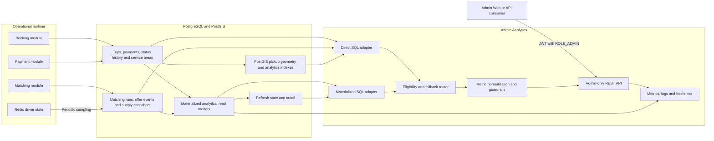
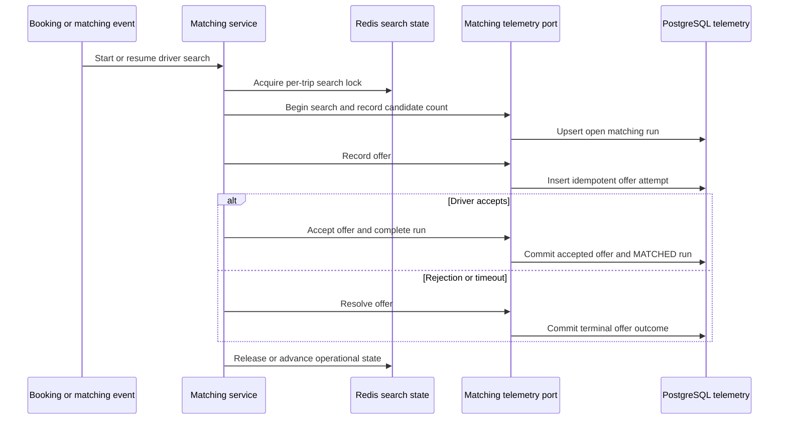
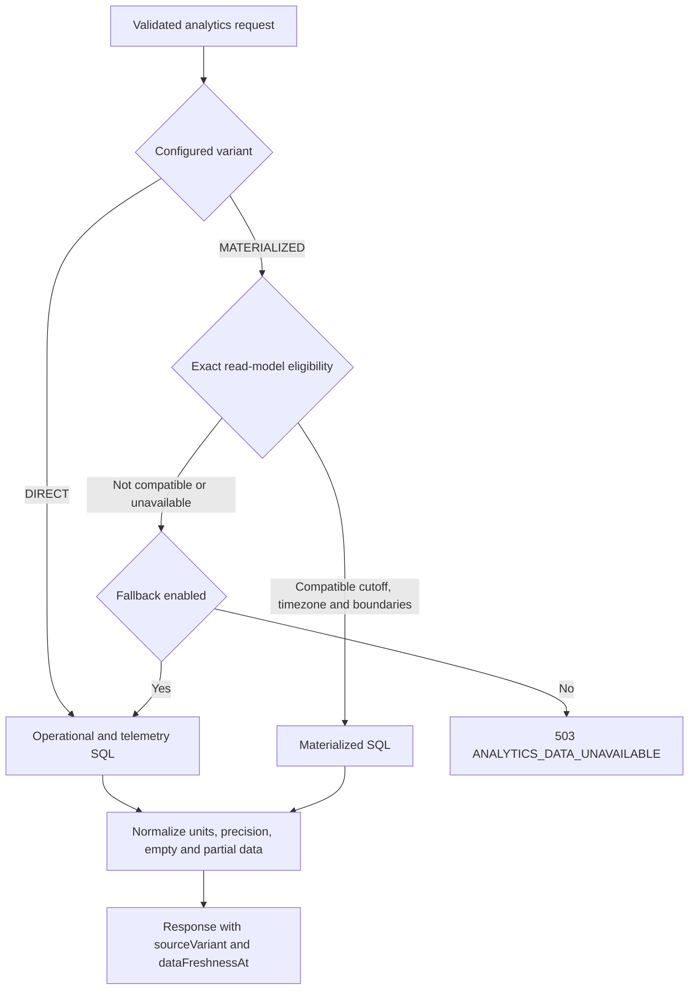

# Admin Analytics Architecture and Data Flow

> Architecture version: 1.0
>
> Applies to backend commits through Phase 8

## 1. System Boundary

Admin Analytics is a read-only reporting subsystem inside the GoRide modular
monolith. It does not replace booking, matching, payment or tracking. Those
modules remain the owners of operational state; Analytics adds durable matching
telemetry, periodic driver-supply samples and analytical read paths.

## 2. Write Path

Operational actions remain authoritative. Matching telemetry is written through
an internal port so that Redis search state and PostgreSQL analytical state do
not become one accidental transaction.

The consistency and recovery decision is frozen in
[ADR-001](adr/ADR-001-matching-telemetry-consistency.md). An empty Redis
candidate search does not automatically close a run as `NO_DRIVER`; open runs
are excluded from terminal success/failure rates.

Driver supply is sampled from Redis every configured interval. An incomplete
Redis read is skipped and exposed through a bounded metric instead of writing a
misleading zero-supply snapshot.

## 3. Read and Refresh Path

All public requests use `[from, to)` time ranges. The service validates and
normalizes the filter before executing SQL.

Materialized eligibility is intentionally conservative:

- overview and matching require reporting-day boundaries;
- demand and supply require reporting-hour boundaries and a supported bucket;
- heatmap requires reporting-hour boundaries and no ad-hoc bounding box;
- reporting timezone, projected SRID and base cell size must match refresh
  metadata;
- incompatible requests fall back to exact direct SQL when fallback is enabled.

The refresh service obtains a PostgreSQL advisory transaction lock. The first
refresh is non-concurrent; subsequent refreshes use
`REFRESH MATERIALIZED VIEW CONCURRENTLY`. It records status, duration, error and
the database transaction cutoff in `analytics.materialized_refresh_state`.

## 4. Data Ownership

| Data | Owner/source of truth | Analytics use |
| --- | --- | --- |
| Trips and status history | Booking | Demand, throughput, cancellation and no-driver metrics |
| Completed payments | Payment | Revenue and completed-payment counts |
| Pickup geometry and service areas | Booking/service-area modules | PostGIS filtering and square-grid heatmap |
| Matching runs and offer events | Matching telemetry adapter | Matching performance and funnel |
| Live driver state | Redis | Input to periodic supply snapshots only |
| Driver supply snapshots | Analytics telemetry | Supply averages and coverage |
| Materialized views | Analytics | Optional derived read models, never operational truth |

## 5. Correctness Boundaries

- PostgreSQL stores timestamps in UTC; calendar grouping uses the requested
  reporting timezone.
- Revenue includes only payments in `COMPLETED` state and uses `paid_at`.
- Direct and materialized results must match at the same cutoff before timing.
- Every response exposes the physical source and freshness cutoff.
- Missing supply samples are not converted into zero drivers.
- Detailed locations, user identifiers, trip identifiers and cell identifiers
  are not observability metric tags.

The formulas and cohort timestamps are normative in the
[metric dictionary](metric-dictionary.md). The HTTP representation is normative
in the [API contract](api-contract.md).

## 6. Deployment Shape

`DIRECT` is the production default. Materialized refresh and query selection are
separate feature flags so a deployment can:

1. apply and verify release SQL;
2. enable refresh while continuing to serve direct queries;
3. validate freshness and direct/materialized equivalence;
4. enable materialized reads only after environment-specific evidence;
5. return to direct mode before rollback.

The release chain and reverse rollback order are verified by
`AdminAnalyticsReleaseChainIntegrationTests`.
