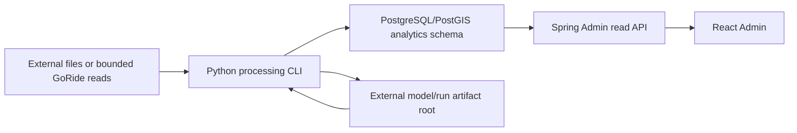

# ADR-001: Processing-layer boundary and serving architecture

> Status: Accepted for Phase 0
>
> Date: 2026-08-08
>
> Decision owners: GoRide Admin Analytics thesis implementation

## Context

Admin Analytics Phase 8 provides durable matching/supply telemetry,
PostGIS-based historical demand, direct/materialized query variants and
Admin-only read APIs. It does not perform forecasting. Training or inference
inside an HTTP request would couple CPU-intensive, failure-prone analytical
work to the transactional Spring application. Letting the browser call a model
process would bypass Admin RBAC, stable error contracts and data-freshness
guardrails.

The thesis also needs a real dataset. Porto Taxi supplies real timestamps and
pickup coordinates but represents a different geography and demand-event
semantics from GoRide. Mixing Porto records into GoRide operational tables or
serving a Porto-trained model as a Ho Chi Minh City model would create invalid
system and research claims.

## Decision

Use a batch-oriented Python processing layer in the backend repository, with
PostgreSQL/PostGIS as the durable serving store and Spring Boot as the only
Admin HTTP boundary.

### Runtime responsibilities

| Boundary | Responsibility |
| --- | --- |
| Python | Extraction, quality gates, aggregation, feature engineering, training, backtesting and scheduled inference |
| PostgreSQL/PostGIS | Run/model metadata, online features when required, forecasts, evaluation summaries and spatial geometry |
| External artifact root | Immutable raw files, Parquet intermediates, raw predictions and model binaries |
| Spring Boot | Admin RBAC, request validation, pagination, freshness, response caps, OpenAPI and observability |
| React Admin | Read-only exploration of processing status, evaluation and forecasts |

### Execution model

- Training, evaluation and inference are separate CLI commands.
- A run reads an immutable source cutoff and writes under a unique run ID.
- Failed quality gates stop downstream stages.
- Failed inference never publishes a partial run as successful.
- Only an approved model version may generate non-demo forecasts.
- The core implementation is scheduled batch, not streaming.

### Dataset isolation

Two profiles share code but not claims or storage namespaces:

1. `porto-thesis` reads the external Porto artifact and uses a dedicated
   experiment database/artifact namespace.
2. `goride-local` reads GoRide data and writes integration/demo forecasts into
   the GoRide analytics schema.

Porto and GoRide rows are never combined into one training/test population.
The Admin UI may show GoRide demo/operational forecasts. Porto results are
reported through evaluation artifacts. A future UI research mode must label
the dataset and geography explicitly.

### Model artifact policy

- Model binaries do not live in Git or database byte columns.
- `model_versions` stores metadata, lifecycle and SHA-256 checksum.
- The processing layer verifies the checksum before inference.
- Artifact paths are resolved below `GORIDE_ANALYTICS_DATA_ROOT`; HTTP
  responses never expose filesystem paths.

### Security policy

- Database passwords and artifact-store credentials are environment variables.
- The processing role receives only the grants required by its stage.
- The serving API is read-only and protected by `ROLE_ADMIN`.
- Raw trip/user identifiers and exact trajectories are not returned by
  forecast endpoints.
- A credential previously committed to Git must be rotated outside the
  repository; removing it from the current file is not sufficient.

## Alternatives considered

### Train and infer inside Spring Boot

Rejected for the core scope. Java could host a model, but it would place data
science dependencies and long-running training lifecycle inside the modular
monolith without improving the research question.

### Browser calls a Python HTTP service

Rejected. It duplicates authentication/error/freshness logic and exposes a new
network boundary solely for the UI.

### A separate data warehouse and streaming platform

Rejected for the thesis core. It adds deployment and consistency questions
that do not help evaluate short-horizon demand forecasting at the current
scale.

### Import Porto trips into GoRide `trips`

Rejected. Porto rows are not GoRide users/bookings, use different semantics and
would contaminate operational metrics.

## Consequences

### Positive

- Processing can fail, retry and evolve without blocking transactional APIs.
- Forecasts use the existing Admin security and response conventions.
- Offline experiment artifacts remain reproducible and independently
  checksum-verifiable.
- Geographic and dataset claim boundaries remain explicit.

### Costs

- Python and Java dependency lifecycles must both be maintained.
- Database release and artifact retention policies are required.
- Local development needs an external data root and an experiment database.
- A scheduler or job runner is required before operational inference.

## Follow-up decisions

- Phase 1 freezes the Python runtime and dependency lock.
- Phase 2 freezes forecast schema, grants and retention indexes.
- Phase 6 decides whether a deep spatio-temporal model is justified.
- Phase 7 freezes scheduling, approval and retry semantics.
