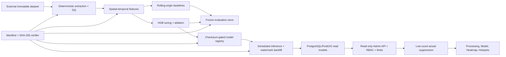

# Demand-Forecasting Architecture

## Responsibility boundaries

| Layer | Responsibility |
| --- | --- |
| Python batch | Extraction, quality, features, training/evaluation, registry and inference |
| PostgreSQL/PostGIS | Durable run/model/forecast/evaluation state and indexed spatial reads |
| Spring Boot | Admin RBAC, validation, freshness, privacy suppression, limits and stable errors |
| React Admin | Filter, map/table/chart rendering and explanation of backend-owned values |
| External artifact root | Raw data, Parquet predictions, model bundle and immutable manifests |

The browser never calls Python and never recomputes MAE/RMSE/WAPE, hotspot rank
or actual error. Model artifacts and raw location/trip records never cross the API.

## Trust and privacy boundary

Raw trajectories are restricted batch inputs. PostgreSQL stores aggregate cells
and internal lineage. The Admin boundary requires the Admin role, enforces query
caps/ranges and suppresses positive actual counts below three. Forecast values
remain visible because they are model output; the corresponding sensitive low-count
actual/error/evaluation timestamp becomes null with `ACTUAL_SUPPRESSED` status.

This is defense in depth, not a formal privacy proof. Deployment must additionally
restrict database, artifact-root and log access.

## Failure model

- Every stage writes immutable artifacts and a processing audit.
- Quality FAIL terminates the stage before promotion/publication.
- Model checksum mismatch terminates before deserialization/inference.
- Forecast publication and terminal status are one transaction.
- Idempotency keys prevent duplicate model/cutoff/config publication.
- Actual backfill waits until all selected horizons plus watermark delay close.
- API database failures map to a stable unavailable contract; stale data is labelled.

## Scale controls

- Maximum forecast API rows: 5,000; hotspots: 200; evaluation rows: 1,000.
- Maximum forecast range: 31 days; supported grids: 250/500/1000/2000 m.
- Query timeout: 10 seconds; hotspot and geometry GiST/B-tree indexes are verified.
- Sensitivity feature runs are Parquet-only to avoid expanding the serving database.
